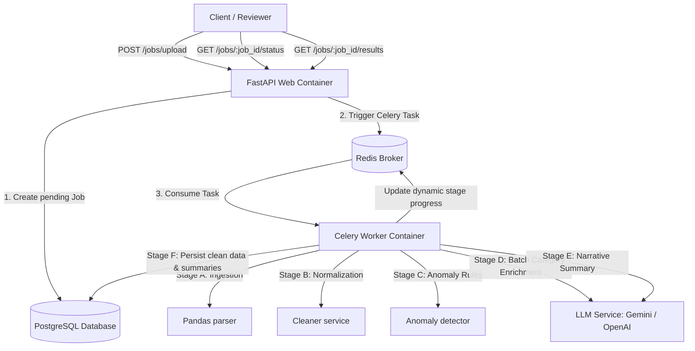

# AI-Powered Transaction Processing Pipeline

An asynchronous production-grade backend processing pipeline for dirty financial transactions. The system ingests CSV uploads via Pandas, cleans and normalizes dates and amounts, detects transaction anomalies, enriches categories in batches using LLMs (Gemini/OpenAI), and generates narrative summaries.

---

## Architecture Diagram



---

## Folder Structure

```text
app/
  api/
    routes/
      jobs.py         # Upload, listing, results, and Redis progress polling
  core/
    config.py         # Pydantic configuration settings
    database.py       # SQLAlchemy engine & session helper
    celery.py         # Celery configuration settings (acks_late=True, prefetch=1)
    logging.py        # Logging structure
  models/
    job.py            # Job schema
    transaction.py    # Transaction schema (raw dates/amounts, anomalies)
    summary.py        # JobSummary schema (spend totals, narratives)
  schemas/
    job.py            # Job Pydantic validation schemas
    transaction.py    # Transaction validation schemas
    summary.py        # JobSummary validation schemas
  services/
    csv_parser.py     # Stage A: Pandas parser
    cleaner.py        # Stage B: Deduplication & amount/date cleaner
    anomaly_detector.py # Stage C: Median rules (job-scoped only)
    llm_service.py    # Stage D & E: Category categorizer & narrative generator
    summary_builder.py# Aggregations compiler
  tasks/
    worker.py         # Celery task pipeline orchestrator
  main.py             # FastAPI entrypoint
migrations/           # Alembic migrations history
docker/
  api.Dockerfile      # Web container Dockerfile
  worker.Dockerfile   # Celery worker Dockerfile
tests/                # Unit and integration test suite
docker-compose.yml    # Database, Redis, Migrations, API, and Worker config
.env.example          # Environment template
requirements.txt      # Dependency catalog
```

---

## Getting Started

### 1. Environment Setup
Create a `.env` file in the root directory and specify your parameters (see `.env.example`):

```bash
DATABASE_URL=postgresql://postgres:postgres@db:5432/transactions_db
REDIS_URL=redis://redis:6379/0
LLM_PROVIDER=gemini
LLM_API_KEY=your_gemini_api_key
UPLOAD_DIR=/workspace/uploads
LOG_LEVEL=INFO
```

### 2. Run the Stack
Start all services in detached mode with Docker Compose. This automatically runs Alembic migrations, creates all tables, and starts both the FastAPI server and Celery background workers:

```bash
docker compose up --build
```

- API Server: [http://localhost:8000](http://localhost:8000)
- Interactive Documentation: [http://localhost:8000/docs](http://localhost:8000/docs)

---

## API Contracts

### 1. Upload CSV File
- **Endpoint**: `POST /jobs/upload`
- **Payload**: `multipart/form-data` with key `file` containing the CSV file.

**curl example:**
```bash
curl -X POST "http://localhost:8000/jobs/upload" \
  -H "accept: application/json" \
  -H "Content-Type: multipart/form-data" \
  -F "file=@transactions.csv"
```

**Response:**
```json
{
  "job_id": "0b3aa954-1d94-420d-94f6-ef523292330b",
  "status": "pending"
}
```

---

### 2. Poll Job Status
- **Endpoint**: `GET /jobs/{job_id}/status`

**curl example:**
```bash
curl -X GET "http://localhost:8000/jobs/0b3aa954-1d94-420d-94f6-ef523292330b/status"
```

**Response (completed):**
```json
{
  "status": "completed",
  "filename": "transactions.csv",
  "created_at": "2026-06-21T22:12:14.453Z",
  "processing_started_at": "2026-06-21T22:12:14.456Z",
  "completed_at": "2026-06-21T22:12:16.890Z",
  "progress": {
    "stage": "completed",
    "completed": 4,
    "total": 4
  },
  "error_message": null
}
```

---

### 3. Retrieve Job Results
- **Endpoint**: `GET /jobs/{job_id}/results`

**curl example:**
```bash
curl -X GET "http://localhost:8000/jobs/0b3aa954-1d94-420d-94f6-ef523292330b/results"
```

**Response:**
```json
{
  "cleaned_transactions": [
    {
      "id": "a1f9e20a-8d19-4503-b092-2b3b8ef10928",
      "job_id": "0b3aa954-1d94-420d-94f6-ef523292330b",
      "txn_id": "TXN1065",
      "raw_date": "04-09-2024",
      "date": "2024-09-04",
      "merchant": "Flipkart",
      "raw_amount": "10882.55",
      "amount": 10882.55,
      "currency": "INR",
      "status": "SUCCESS",
      "category": "Shopping",
      "account_id": "ACC003",
      "notes": "Refund expected",
      "is_anomaly": false,
      "anomaly_reason": null,
      "llm_category": null,
      "llm_raw_response": null,
      "llm_failed": false
    }
  ],
  "anomalies": [],
  "category_breakdown": {
    "Shopping": 10882.55
  },
  "currency_totals": {
    "INR": 10882.55,
    "USD": 0.00
  },
  "summary": {
    "total_spend_inr": 10882.55,
    "total_spend_usd": 0.00,
    "top_merchants": ["Flipkart"],
    "anomaly_count": 0,
    "narrative": "Spending patterns reveal highly contained shopping expenses with zero anomalies detected. Account stands in a solid and low risk condition.",
    "risk_level": "low"
  }
}
```

---

### 4. List All Jobs
- **Endpoint**: `GET /jobs`
- **Query Params**: `status` (optional status filter, e.g., `/jobs?status=completed`)

**curl example:**
```bash
curl -X GET "http://localhost:8000/jobs"
```

**Response:**
```json
[
  {
    "job_id": "0b3aa954-1d94-420d-94f6-ef523292330b",
    "filename": "transactions.csv",
    "status": "completed",
    "row_count_raw": 92,
    "row_count_clean": 88,
    "llm_failed_batches": 0,
    "created_at": "2026-06-21T22:12:14.453Z",
    "processing_started_at": "2026-06-21T22:12:14.456Z",
    "completed_at": "2026-06-21T22:12:16.890Z"
  }
]
```

---

## Local Development & Testing

You can spin up local test runs using virtual environment configs:

```bash
# 1. Setup virtual env
python3 -m venv .venv
source .venv/bin/activate

# 2. Install requirements
pip install -r requirements.txt

# 3. Execute unit and integration tests (uses in-memory SQLite + mocked task workers)
PYTHONPATH=. pytest tests/
```

---

## Production Scalability Bottlenecks

1. **Celery Worker Thread Saturation**: Synchronous Python code processing large CSVs blocks workers.
   - *Mitigation*: Run Celery workers with concurrency configurations (`--concurrency=X`) and configure a dedicated rate limiter for external LLM client requests.
2. **PostgreSQL Database Connection Pools**: Spawning hundreds of threads/tasks concurrently can overwhelm the database engine connection limits.
   - *Mitigation*: Run PgBouncer as a database connection proxy, and reuse sessions.
3. **Queue Ingestion Memory Pressures**: `pandas.read_csv()` loads the entire file into memory. For large datasets, this can lead to Out of Memory (OOM) worker restarts.
   - *Mitigation*: Stream files or process them in chunks (`chunksize` parameter in pandas), yielding batches to Celery workers.

---

## Future Improvements

1. **Dead Letter Queues (DLQ)**: Queue permanently failing jobs separately to prevent queue blockages and enable retry audits.
2. **Chunk-Level Processing (Celery Chords)**: Break a single job into 5,000-row chunks, run them in parallel on multiple worker nodes, and combine results in a chord callback.
3. **Optimistic Locking**: Prevent race conditions if multiple tasks attempt to update the same account median calculation concurrently.