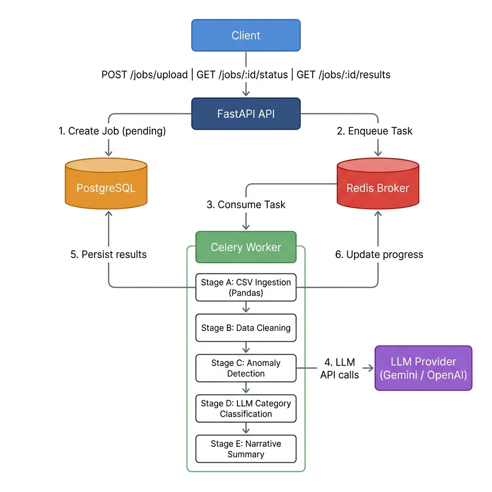

# AI-Powered Transaction Processing Pipeline

An asynchronous, production-grade backend pipeline for dirty financial transaction data. Upload a CSV → background worker cleans, validates, detects anomalies, enriches categories via LLM, and returns a structured narrative summary.

---

## Architecture Diagram



**Flow:**

```
Client
  ↓  POST /jobs/upload | GET /jobs/:id/status | GET /jobs/:id/results
FastAPI API
  ↓ (1) Create Job (pending)          ↓ (2) Enqueue Task
PostgreSQL                          Redis Broker
                                        ↓ (3) Consume Task
                                    Celery Worker
                                      ├─ Stage A: CSV Ingestion (Pandas)
                                      ├─ Stage B: Data Cleaning
                                      ├─ Stage C: Anomaly Detection
                                      ├─ Stage D: LLM Category Classification → LLM Provider
                                      └─ Stage E: Narrative Summary            (Gemini / OpenAI)
                                        ↓ (5) Persist results    ↑ (6) Update progress
                                    PostgreSQL                  Redis
```

---

## Folder Structure

```text
app/
  api/routes/jobs.py         # Upload, status polling, results, job list
  core/
    config.py                # Pydantic-settings configuration
    database.py              # SQLAlchemy engine & session
    celery.py                # Celery app (acks_late=True, prefetch=1)
    logging.py               # Structured JSON logging setup
  models/
    job.py                   # Job ORM model
    transaction.py           # Transaction ORM model (raw + cleaned fields)
    summary.py               # JobSummary ORM model
  schemas/
    job.py                   # Job Pydantic schemas
    transaction.py           # Transaction Pydantic schemas
    summary.py               # JobSummary Pydantic schemas
  services/
    csv_parser.py            # Stage A – Pandas CSV ingestion & header validation
    cleaner.py               # Stage B – Deduplication, date/amount normalization
    anomaly_detector.py      # Stage C – Job-scoped median anomaly rules
    llm_service.py           # Stage D & E – Batched LLM classification & narrative
    summary_builder.py       # Metric aggregator (spend totals, top merchants)
  tasks/worker.py            # Celery pipeline orchestrator (A → F)
  main.py                    # FastAPI application entrypoint
migrations/                  # Alembic migration history (DO NOT use create_all)
docker/
  api.Dockerfile             # API container image
  worker.Dockerfile          # Celery worker container image
tests/
  test_unit.py               # Unit tests for services
  test_integration.py        # Integration tests (SQLite + mocked Celery)
docker-compose.yml           # Full stack: db, redis, migration, api, worker
.env.example                 # Environment variable template
transactions.csv             # Sample dirty transaction dataset (96 rows)
requirements.txt             # Python dependencies
```

---

## Setup

### 1. Configure environment variables

Copy the example env file and fill in your LLM API key:

```bash
cp .env.example .env
```

`.env` values:

```bash
DATABASE_URL=postgresql://postgres:postgres@db:5432/transactions_db
REDIS_URL=redis://redis:6379/0
LLM_PROVIDER=gemini          # or: openai
LLM_API_KEY=your_api_key_here
LLM_MODEL=gemini-2.5-flash   # or: gpt-4o-mini
UPLOAD_DIR=/workspace/uploads
LOG_LEVEL=INFO
```

### 2. Start the full stack

```bash
docker compose up --build
```

This single command:
- Starts PostgreSQL and Redis (with health checks)
- **Runs Alembic migrations automatically** via a dedicated `migration` container
- Starts the FastAPI API server on port `8000`
- Starts the Celery background worker

> **Note:** The `api` and `worker` containers depend on `migration` completing successfully (`service_completed_successfully`). You never need to run migrations manually.

- API server: [http://localhost:8000](http://localhost:8000)
- Interactive Swagger docs: [http://localhost:8000/docs](http://localhost:8000/docs)

---

## Run Migrations

Migrations run **automatically** on every `docker compose up` via the `migration` service:

```yaml
# docker-compose.yml (excerpt)
migration:
  command: alembic upgrade head
  depends_on:
    db:
      condition: service_healthy
```

To run migrations manually (e.g., during development):

```bash
docker compose run --rm migration alembic upgrade head
```

To create a new migration after model changes:

```bash
docker compose run --rm migration alembic revision --autogenerate -m "describe_change"
```

---

## Test

Run the full test suite (unit + integration) inside the running API container:

```bash
docker compose exec api pytest
```

Or with verbose output:

```bash
docker compose exec api pytest -v
```

Tests use an **in-memory SQLite database** and **mocked Celery tasks** — no external services required. The suite covers:

- `test_unit.py` — CSV parser, cleaner, anomaly detector, summary builder
- `test_integration.py` — Full upload → status → results lifecycle

---

## API Docs

FastAPI automatically generates interactive API documentation:

| Interface | URL |
|-----------|-----|
| **Swagger UI** | [http://localhost:8000/docs](http://localhost:8000/docs) |
| **ReDoc** | [http://localhost:8000/redoc](http://localhost:8000/redoc) |
| **OpenAPI JSON** | [http://localhost:8000/openapi.json](http://localhost:8000/openapi.json) |

---

## API Reference

### POST `/jobs/upload` — Upload CSV

```bash
curl -X POST "http://localhost:8000/jobs/upload" \
  -H "Content-Type: multipart/form-data" \
  -F "file=@transactions.csv"
```

**Validation rules:**
- Content-Type must be `text/csv` or `application/vnd.ms-excel` (HTTP 415 otherwise)
- File extension must be `.csv` (HTTP 400 otherwise)
- File size must be ≤ 10 MB (HTTP 413 otherwise)

**Response `202`:**
```json
{
  "job_id": "0b3aa954-1d94-420d-94f6-ef523292330b",
  "status": "pending"
}
```

---

### GET `/jobs/{job_id}/status` — Poll Status

```bash
curl "http://localhost:8000/jobs/0b3aa954-1d94-420d-94f6-ef523292330b/status"
```

**Response `200`:**
```json
{
  "status": "processing",
  "filename": "transactions.csv",
  "created_at": "2026-06-21T22:12:14.453Z",
  "processing_started_at": "2026-06-21T22:12:14.456Z",
  "completed_at": null,
  "progress": {
    "stage": "LLM Classification",
    "completed": 15,
    "total": 30
  },
  "error_message": null
}
```

`status` values: `pending` → `processing` → `completed` | `failed`

---

### GET `/jobs/{job_id}/results` — Retrieve Results

```bash
curl "http://localhost:8000/jobs/0b3aa954-1d94-420d-94f6-ef523292330b/results"
```

**Response `200`:**
```json
{
  "cleaned_transactions": [
    {
      "id": "a1f9e20a-8d19-4503-b092-2b3b8ef10928",
      "job_id": "0b3aa954-1d94-420d-94f6-ef523292330b",
      "txn_id": "TXN1065",
      "raw_date": "04-09-2024",
      "date": "2024-09-04",
      "merchant": "Flipkart",
      "raw_amount": "10882.55",
      "amount": 10882.55,
      "currency": "INR",
      "status": "SUCCESS",
      "category": "Shopping",
      "account_id": "ACC003",
      "notes": "Refund expected",
      "is_anomaly": false,
      "anomaly_reason": null,
      "llm_category": null,
      "llm_raw_response": null,
      "llm_failed": false
    }
  ],
  "anomalies": [],
  "category_breakdown": { "Shopping": 10882.55 },
  "currency_totals": { "INR": 10882.55, "USD": 0.00 },
  "summary": {
    "total_spend_inr": 10882.55,
    "total_spend_usd": 0.00,
    "top_merchants": ["Flipkart"],
    "anomaly_count": 0,
    "narrative": "Spending patterns reveal contained shopping expenses with zero anomalies detected.",
    "risk_level": "low"
  }
}
```

---

### GET `/jobs` — List All Jobs

```bash
curl "http://localhost:8000/jobs"
curl "http://localhost:8000/jobs?status=completed"
```

**Response `200`:**
```json
[
  {
    "job_id": "0b3aa954-1d94-420d-94f6-ef523292330b",
    "filename": "transactions.csv",
    "status": "completed",
    "row_count_raw": 96,
    "row_count_clean": 88,
    "llm_failed_batches": 0,
    "created_at": "2026-06-21T22:12:14.453Z",
    "processing_started_at": "2026-06-21T22:12:14.456Z",
    "completed_at": "2026-06-21T22:12:16.890Z"
  }
]
```

---

## Pipeline Stages

| Stage | Service | Description |
|-------|---------|-------------|
| A | `csv_parser.py` | Pandas CSV ingestion; validates headers and rejects malformed files |
| B | `cleaner.py` | Deduplication by `txn_id`; normalizes dates (7 formats), strips currency symbols, uppercases status |
| C | `anomaly_detector.py` | Job-scoped median rules: flags amounts > 3× median and invalid dates |
| D | `llm_service.py` | Batched LLM category enrichment (batch size 15) with retry + fallback to `"Other"` |
| E | `llm_service.py` | Narrative summary generation with `risk_level` classification |
| F | `worker.py` | Persists all cleaned `Transaction` records and `JobSummary` to PostgreSQL |

---

## Key Design Decisions

| Decision | Rationale |
|----------|-----------|
| **Celery idempotency guard** | `if job.status in ("completed", "processing"): return` — prevents Celery retries from re-processing jobs |
| **Redis for progress** | Lightweight polling without polling the database; keys expire in 24 hours |
| **Job-scoped anomaly detection** | Median computed only on current job's rows — avoids cross-job contamination |
| **Alembic-only migrations** | `Base.metadata.create_all` is never used; schema is versioned and reproducible |
| **acks_late=True** | Tasks are acknowledged only after completion — prevents silent data loss on worker crash |

---

## Scalability Notes

1. **Worker saturation** — Increase concurrency with `--concurrency=N`; add a Celery rate limiter for LLM API calls
2. **DB connection pools** — Add PgBouncer in front of PostgreSQL for connection multiplexing
3. **Large CSV memory** — Switch `parse_and_validate_csv` to `pandas.read_csv(chunksize=5000)` for streaming ingestion

---

## Future Improvements

1. **Dead Letter Queues** — Route permanently failing jobs to a DLQ for audit and manual replay
2. **Celery Chords** — Parallelize chunk-level processing across worker nodes, merge via chord callback
3. **Optimistic Locking** — Prevent race conditions if concurrent tasks touch the same account's median