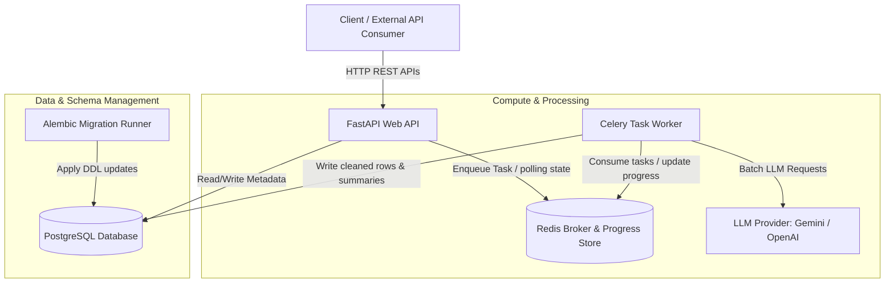

# System Architecture Review: AI-Powered Transaction Processing Pipeline

This review evaluates the architectural integrity, scalability, maintainability, resilience, and security of the asynchronous transaction processing backend.

---

## 1. System Decomposition (C4 Container Diagram)

The following container diagram represents the logical boundaries and interaction patterns of the pipeline:



---

## 2. Key Architectural Strengths

1.  **Strict Layered Separation of Concerns**:
    *   **Routing Layer** (`app/api/routes/`) handles HTTP parsing, file size/MIME validation, and task dispatching. It remains completely stateless.
    *   **Data Models** (`app/models/`) are separated from Pydantic schema validation structures (`app/schemas/`), decoupling internal DB layouts from the public API contract.
    *   **Domain Services** (`app/services/`) are pure functional services (e.g., date normalization, median calculations) that do not leak framework context (FastAPI or Celery).
    *   **Worker Orchestration** (`app/tasks/worker.py`) functions purely as a transaction manager, handling progress side-effects, rollbacks, and retry boundaries.

2.  **Robust Async Orchestration Policies**:
    *   **Late Acknowledgment (`acks_late=True`)**: Tasks are only removed from Redis after successful completion. If a worker container crashes mid-job, the task is safely re-queued.
    *   **Worker Prefetch Limit (`worker_prefetch_multiplier=1`)**: Prevents a single worker thread from hogging multiple heavy jobs, ensuring fair distribution across container scaling groups.
    *   **Idempotency Guards**:
        ```python
        if job.status in ("completed", "processing"):
            return True
        ```
        Protects database state against duplicate delivery or Celery task retries.

3.  **Reproducible Schema History**:
    *   Using Alembic migrations instead of `Base.metadata.create_all` ensures schema transitions are versioned, transactional, and trackable.
    *   The `migration` container boot-sequence ensures zero database mismatch/schema drift during automated horizontal scaling.

---

## 3. Risks & Trade-offs

| Risk Area | Architectural Impact | Mitigation Strategy |
|:---|:---|:---|
| **Memory Exhaustion (OOM)** | **High**: Ingesting large files via `pandas.read_csv()` loads the entire file into RAM, risking worker crashes on larger datasets. | Switch to generator-based streaming processing (`pd.read_csv(chunksize=N)`). |
| **External LLM Dependency Blocking** | **Medium**: The Celery worker invokes external LLM HTTP requests synchronously. If the LLM provider experiences latency spikes, workers will saturate. | Add a rate-limiter, transition calls to async HTTP clients (e.g., `httpx.AsyncClient`), or split the task into multiple chunks. |
| **Database Connection Exhaustion** | **Medium**: Spawning multiple workers increases concurrent PostgreSQL connection limits, which can saturate the database engine. | Deploy **PgBouncer** as a connection pool proxy between compute containers and the PostgreSQL engine. |
| **Cross-Task Anomaly Contamination** | **Low**: Anomalies are computed relative to medians within a single job instead of historical statistics. | *Design Trade-off*: Computed locally to remain stateless and avoid slow table scans; acceptable given the batch processing profile. |

---

## 4. Detailed Component Evaluation

### A. Ingestion & Validation Layer
*   **Strengths**: Size checking (`MAX_UPLOAD_SIZE = 10MB`) and MIME-type restrictions (`ALLOWED_MIME_TYPES`) happen directly on the raw HTTP input streams before write operations, protecting the filesystem from malicious resource consumption.
*   **Recommendation**: Move temporary file storage out of local directories to a cloud object store (e.g., AWS S3 or Google Cloud Storage) if scaled beyond a single host.

### B. Worker & Queue Layer
*   **Strengths**: Celery tasks are cleanly bound to specific stages, updating Redis-based progress records at each transition point.
*   **Recommendation**: The progress state JSON in Redis has an expiry (`ex=86400`). This is excellent. Consider switching task state updates from Celery to Redis pub/sub if real-time dashboard subscriptions are required in the future.

### C. Database & Persistence Layer
*   **Strengths**: High-precision decimal formats (`Numeric(18, 4)`) are used for currency storage, preventing IEEE 754 float precision errors on transaction math.
*   **Recommendation**: Create a composite index on `transactions(job_id, is_anomaly)` and `transactions(job_id, category)` to optimize result retrieval speeds on large datasets.

---

## 5. Security Posture

1.  **Data Isolation**: Cleaned data paths map to jobs via unique UUIDs, preventing cross-tenant information disclosure.
2.  **Input Sanitation**: Raw amount scrubbing uses regex character isolation (`[^0-9.-]`), mitigating injection attempts via dirty text headers.
3.  **Credential Protection**: The environment uses Pydantic Settings, parsing keys exclusively from environment environments (`.env`) rather than hardcoded configurations.

---

## 6. Recommendations & Roadmap

### Phase 1: Near-Term Enhancements (Low effort, high impact)
*   **Index Database Keys**: Add missing indices on the foreign keys of tables (`Transaction.job_id` and `JobSummary.job_id`).
*   **Async HTTP client**: Wrap LLM calls in async pools to prevent Celery thread blocking during latency spikes.

### Phase 2: Medium-Term Scalability
*   **Chunked CSV Processing**: Read files as dataframes of 5,000 records at a time, parsing and streaming iteratively rather than loading all records into memory at once.
*   **Dead Letter Queues**: Create a fallback queue configuration for tasks that fail all retries to ensure main processing pipelines are never bottlenecked.
